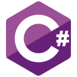

## Hi there 👋

I'm working as a technical consultant and developer at [Doclogic](https://www.doclogic.nl) | Part of [Decos Information Solutions](https://www.decos.com).  
My specialties are datamigration and creating custom integrations with Decos JOIN Case and Document.

<h3 align="left">Languages:</h3>

  

<h3 align="left">Learning:</h3>

<!--
**michielosinga/michielosinga** is a ✨ _special_ ✨ repository because its `README.md` (this file) appears on your GitHub profile.

Here are some ideas to get you started:

- 🔭 I’m currently working on ...
- 🌱 I’m currently learning ...
- 👯 I’m looking to collaborate on ...
- 🤔 I’m looking for help with ...
- 💬 Ask me about ...
- 📫 How to reach me: ...
- 😄 Pronouns: ...
- ⚡ Fun fact: ...
-->
